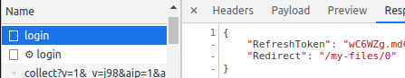

# Degoo Drive

Because Degoo does not provide a way to use their application as a virtual drive, like Google Drive, I have created a project to make this possible, thanks to [pyfuse3](https://github.com/libfuse/pyfuse3) and [Degoo CLI](https://github.com/bernd-wechner/Degoo). This **will not work on Windows**, only available in unix environments

## Requirements

* pyfuse3 requires the **libfuse3-dev** and **fuse3** libraries to run. These can be installed via ``apt install -y libfuse3-dev fuse3`` (Available from **Ubuntu 20.04**)
* Degoo CLI requires **python 3.8** and dependencies included in [requirements.txt](https://github.com/bernd-wechner/Degoo/blob/master/requirements.txt)
* And this project requires both of the above

### Dependencies

````shell
apt update
apt install -y --no-install-recommends git
apt install -y libfuse3-dev fuse3
apt install -y python3.8
apt install -y python3-pip
apt install -y pkg-config
apt install -y python3.8-dev

python3.8 -m pip install appdirs wget python-magic humanize humanfriendly python-dateutil requests clint requests_toolbelt pyfuse3 pyjwt
````

All in one:
````shell
apt update && apt install -y --no-install-recommends git libfuse3-dev fuse3 python3.8 python3-pip pkg-config && python3.8 -m pip install appdirs wget python-magic humanize humanfriendly python-dateutil requests clint requests_toolbelt pyfuse3
````

## Installation

You must clone this repository ``git clone https://github.com/MDKPredator/degoo_drive``. Ensure you have installed git: ``apt install git``

## Configuration

Run **degoo_login** to create the directory with the configuration to access Degoo. Normally it will be created in ```~/.config/degoo```. In this path you should have the following files:
* default_properties.txt
* schedule.json
* credentials.json
* keys.json
* overlay4.txt

Edit file **credentials.json** to enter your credentials (email and password)

**IMPORTANT:** If you log in with Google (**Sign in with Google** button) this method does not work. You will have to change it to login with your email and a password.

## Basic usage

First you must clone this project with ``git clone https://github.com/MDKPredator/degoo_drive``. You can then mount your unit by running the command `python3 fuse_degoo.py`. By default, drive is mounted in `/home/degoo`

## Options

The following options are available:

* ``--mountpoint`` Path where drive will be mounted. Default is `/home/degoo`
* ``--degoo-email`` Email to login in Degoo
* ``--degoo-pass`` Password to login in Degoo
* ``--degoo-refresh-token`` Used when token expires. Alternative if login fails
* ``--degoo-path`` Degoo base path to mount the drive. Default is root `/`
* ``--cache-size`` Size of downloaded chunk
* ``--debug`` Displays logs
* ``--debug-fuse`` Displays the filesystem logs
* ``--allow-other`` Allows other users to access files
* ``--refresh-interval`` Time, in minutes, that Degoo information is refreshed. Default is 10 minutes
* ``--disable-refresh`` Disables the refresh
* ``--flood-sleep-time`` Waiting time, in seconds, before resuming requests once the maximum has been reached
* ``--flood-max-requests`` Maximum number of requests in the period
* ``--flood-time-to-check`` Request control period, in minutes
* ``--change-hostname`` Disable change domain for media files. Default is **false**
* ``--mode`` How to read the content. **Lazy** (default) reads as browsing (recommended for large content). **Eager** to read all content the first time
* ``--config-path`` Path to the configuration files. Default is **~/.config/degoo/**
* ``--plex-split-file`` (Experimental) Check if there are split files to cache the first part

## Docker

This project includes a [Dockerfile](Dockerfile) to mount the virtual drive. You will only need to modify the **credentials.json** file before creating the image:

1. Clone this repository: ``git clone https://github.com/MDKPredator/degoo_drive``
2. Modify ``degoo_config/credentials.json``
3. Create the image ``docker build -t degoo_drive .``
4. Run container ``docker run -dit --privileged --name degoo degoo_drive``

### Examples

Here are some examples of how to pass arguments to the mounting drive

* Run container with debug: ``docker run -dit --privileged --name degoo degoo_drive --debug``
* Run container bypassing login (token and refrehs token): ``docker run -dit --privileged --name degoo degoo_drive --debug --degoo-refresh-token myRefreshToken``
* Change default mountpoint: ``docker run -dit --privileged --name degoo degoo_drive --debug --mountpoint /degoo_drive``

## Degoo Drive and Plex

You can use the docker file ([Dockerfile-plex](Dockerfile-plex)) included in the project to mount the container with the latest version of plex, and the virtual drive. Just follow these steps:

1. Modify the [keys.json](degoo_config/keys.json) file to include **RefreshToken**
2. Create the image: ```docker build -f Dockerfile-plex -t plex_degoo_drive .```
3. Create the volumes in host
4. Create the container: ```docker create --name=plex --net=host --memory="2gb" --privileged --cap-add SYS_ADMIN --device /dev/fuse -e VERSION=latest -e PUID=1001 -e PGID=1001 -e TZ=Europe/Madrid -v /path/to/volume/plex/config:/config -v /path/to/volume/plex/tvshows:/data/tvshows -v /path/to/volume/plex/movies:/data/movies -v /path/to/volume/plex/transcode:/transcode plex_degoo_drive```
5. Go to http://localhost:32400/web/index.html

# Login bypass

If login fails with a **429 Too Many Requests**, or similar, you can bypass it by using directly **refreshToken** provided by Degoo once logged in. To do so, go to https://app.degoo.com/login and open the developer tools to see this data.



# Disclaimer

Uploading files to Degoo (**cp** and **mv** commands) does not work 100% of the time, so it is recommended to use the **cp** command to avoid losing files. In case the upload is unsuccessful, if you have enabled the logs, you will see the following message: **WARN: file [name_of_file.ext] has not been uploaded successfully**
